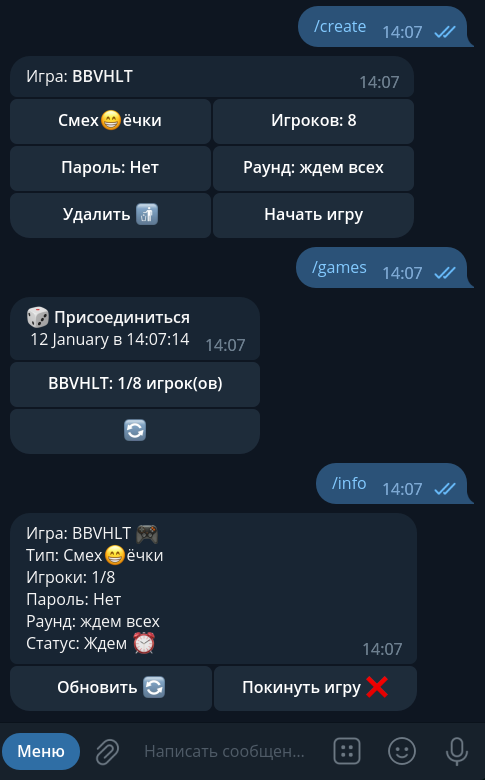

## Mr.Nastolkin_Bot
Play with your friends! [Try it!](https://t.me/mr_nastolkin_bot)

### Install (Debian/Centos - like)
```bash
git clone https://github.com/rombintu/nastolkinbot.git /opt/nastolkinbot
cd /opt/nastolkinbot
python3 -m venv venv
source ./venv/bin/activate
pip install -r deps.txt
sudo cp nastolkinbot.service /etc/systemd/system/
sudo systemctl enable --now nastolkinbot.service
```

### Screenshot
